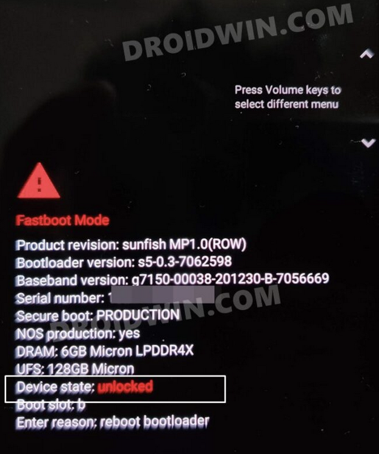
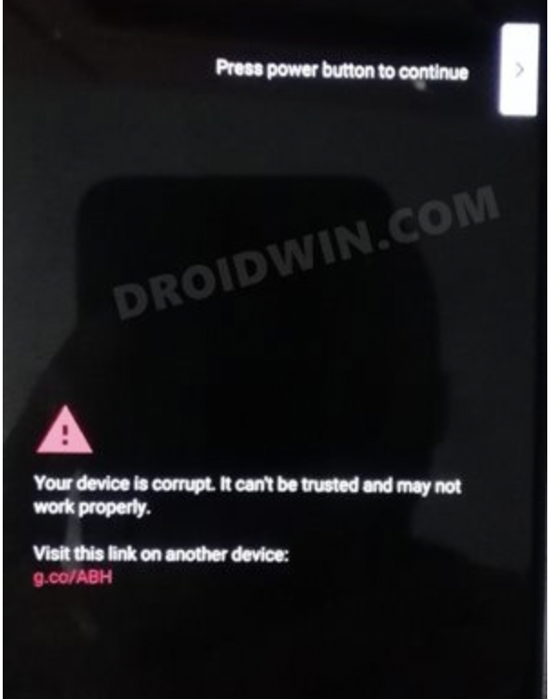

Enter fastboot mode

$ adb reboot bootloader

[Power] + [Volume Down]: Enter fastboot mode: 

# You device is corrupted. It can't be trusted and may not work properly.

## Solution 1: Switch to Slots

boot your device to Fastboot Mode
$ Press [Power] + [Volume Down] for 1 minutes

$ fastboot set_active other

$ fastboot reboot

reference: https://www.droidwin.com/pixel-6-pro-your-device-is-corrupt-it-cant-be-trusted/

## when 2 slots are both corrupted
1. boot your device to Fastboot Mode

$ Press [Power] + [Volume Down] for 1 minutes

$ fastboot flash bootloader bootloader.img

2. boot your device back to Fastboot Mode

$ fastboot reboot-bootloader

# flash the radio file

$ fastboot flash radio radio.img

3. boot your device back to the Fast-Mode

$ fastboot reboot-bootloader

# flash all the other partition files present inside the image.zip file

$ fastboot update  image.zip

4. fastboot reboot your device

$ fastboot reboot

## Your device is still in fast-boot loop after the above commands

$ fastboot flash bootloader bootloader.img

$ fastboot reboot-bootloader

$ fastboot flash radio radio.img

$fastboot reboot-bootloader

format your device and subsequently flash the image.zip

$ fastboot -w update  image.zip

reboot your device

$ fastboot reboot

check current active slot

$ adb reboot bootloader

$ fastboot getvar all | grep current

reference: https://www.droidwin.com/how-to-unbrick-google-pixel-6-pro-via-fastboot-commands/
